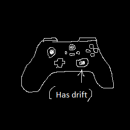

# Create: Tweaked Controllers



A [Create](https://github.com/Creators-of-Create/Create) mod addon that let you control your contraptions using an advanced controller, that you can use with your mouse, keyboard or even your gamepad !

CurseForge link [here](https://www.curseforge.com/minecraft/mc-mods/create-tweaked-controllers)  
Modrinth link [here](https://modrinth.com/mod/create-tweaked-controllers)  

## Building

First of all, you will need a JDK (java development kit) version 17 to build this mod.  
You can check your Java version by running the command  
```java --version```  

Now go to the root of the project, and run  
```./gradlew build```  
to build the project  

The output is located here :  
```build/libs```  

## Using the mod

Please check [the wiki](https://github.com/getItemFromBlock/Create-Tweaked-Controllers/wiki) for more information.

## Supported input method

This mod relies on GLFW (the input/output library used by Minecraft) to handle joystick inputs.  
GLFW handle joystick as follows:  
- If it is detected by GLFW, it will be labelled as a joystick; it will have all of its axis and buttons stored in an unorganised way (the way the driver reads the values)  
- If it has a known mapping, GLFW will also register it as a gamepad. In this situation there will always be 6 axis and 15 buttons which should be roughly the same on all gamepads (note that on some gamepads the A/B-X/Y buttons are inverted, and the two back trigger axis can just be shoulder buttons)  
  
Any joystick/gamepad can work with the mod, as long as it is detected by GLFW.
However, you will need to enable advanced input mode for that. Please check [the wiki](https://github.com/getItemFromBlock/Create-Tweaked-Controllers/wiki) for more infos.  

Here is a list of supported devices:  
- Keyboard  
- Mouse buttons  
- Mouse cursor movements  
- Official gamepads such as Xbox controllers or Playstation DualShock are supported  
- Knockoff/alternate gamepads (like a Logitech controller) should work  
- Joysticks/hotas/racing wheels and other devices are supported, unless they requires some funky drivers in which case I can't do anything for you  
- WiiMotes are (sadly) not supported  

## Remarks

Due to a Create limitation, if a network is updated too many times it will break. This can happen if you connect an axis output to an Adjustable Chain Gearshift, for example. I might do something for this in the future.  

The joystick axis are directly read from GLFW. With most if not all gamepads, the +X axis points to the right, and the +Y axis points down.

IF YOU USE A NINTENDO CONTROLLER, YOU MIGHT WANNA TAKE A LOOK [AT THIS](https://github.com/getItemFromBlock/Create-Tweaked-Controllers/issues/1).
